# image ingestion pipeline examples

```mermaid
flowchart LR
    subgraph corporate network
    A(fa:fa-laptop-code<br>developer)
    B(fas:fa-boxes-stacked<br>internal<br>container registry)
    end
    A -->| push new images | B
    B -->| pull base images | A
    subgraph internet
    C(🐙<br>chainguard registry)
    end
    D{🔎 acceptance criteria<br>- CVE scans<br>- SBOM validation<br>- Sigstore validation}
    D -->| pull tokens<br>or<br>OIDC | C
    B --> D
```

Two paths are shown here, more as a demo than anything else.

1. [`ingest.sh`](ingest.sh) is a simple shell script that runs as acceptance criteria checks to pull from one source (Chainguard registry), run the checks above, then push to another (any OCI compliant registry)
2. [`.github/workflows/ingest.yaml`](.github/workflows/ingest.yaml) is the same workflow and checks, but run within GitHub Actions to show a demo of it working in a CI pipeline.
